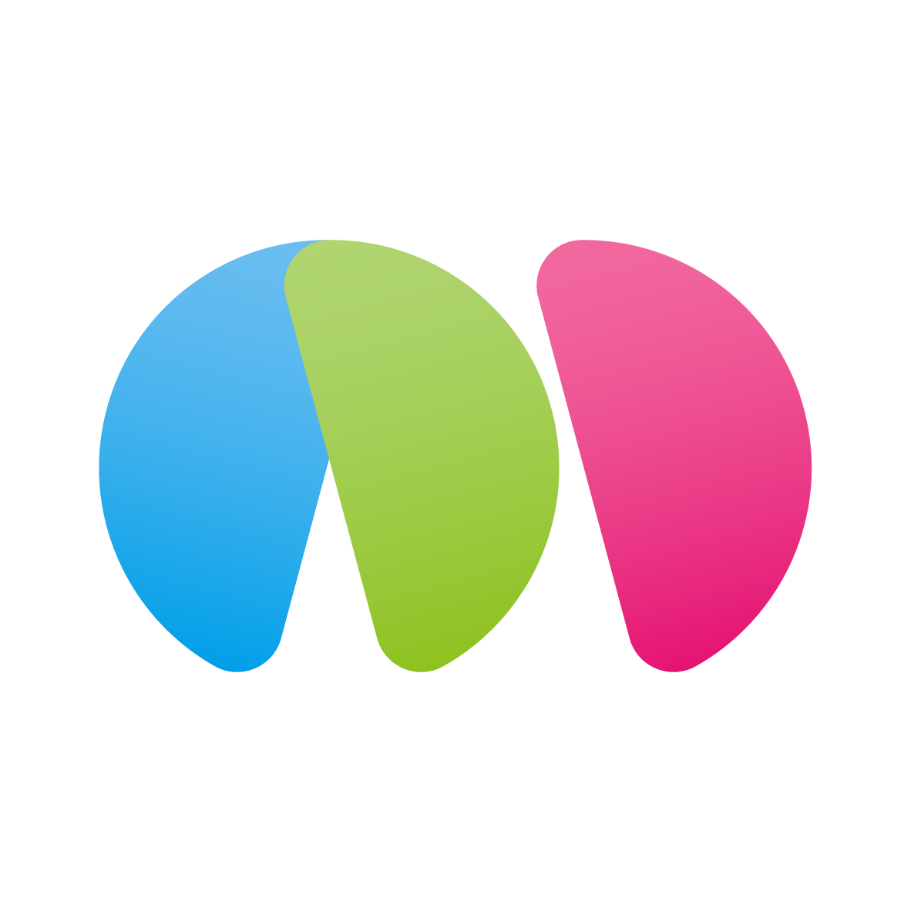

# MarkTown

A Markdown editor totally written by AI.

The pronounciation of `marktown` is both close to markdown and `matang`, or sesame sugar, a speciality of my hometown. It is usually made into a semi-circle shape, which inspired me to create the logo of MarkTown: three pieces of matang put in a way to resemble the letter M (maybe the only non-AI part).

- Developing tools: Trae + Claude Sonnet 3.7.
- Framework: node.js + electron (as suggested by ChatGPT). The developer knows neither of the two.

## Contact

Wenxiong Zhou: wxzhou.pku@gmail.com